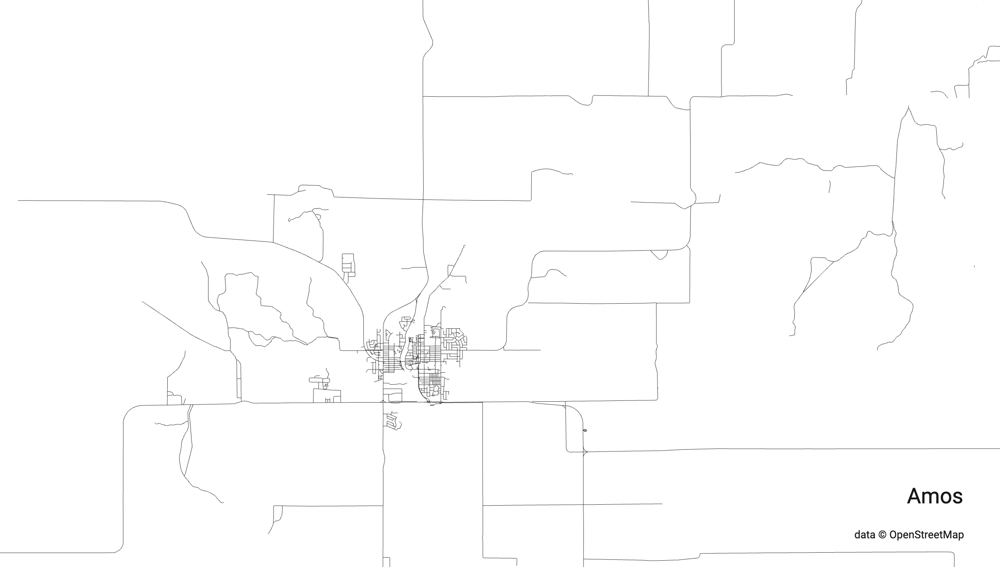
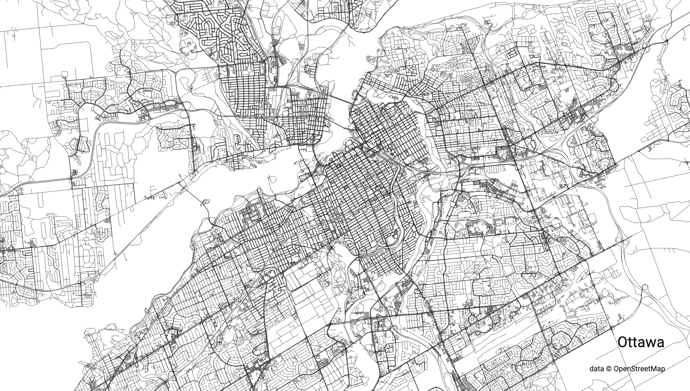

A neat little tool has been making the rounds amongst GIS afficionados since last week, enabling you to pull city boundaries from OpenStreetMap and quickly create a drawing with the city roads.  

## How it Started

  

## How it's going
  

The open-source tool is available here: https://anvaka.github.io/city-roads/

<iframe width=600 height=371 src="https://lichess.org/study/embed/26hAJfZg/32QTWDj7" frameborder=0></iframe>
